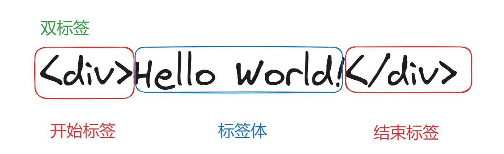

# HTML第一天学习

## 1. 创建文件夹

我们可以创建文件夹来管理所写的代码。

1. 创建一个文件夹
2. 用VSCode打开
3. 在VSCode创建代码文件
4. 得到带后缀的**html**文件


## 2. HTML 基本结构 

首先我们先生成HTML基本结构，按键是**shift+!+Enter**(记住是**英文**的叹号！)，生成的HTML结构如下：

> 我这里设置的缩进是两个字符，所以就显示这样了，如果你是4个字符的缩进也没关系的。听说Vue得是两个字符的，不然会报错。


让我们来研究一下HTML的结构，HTML结构是由<!DOCTYPE>声明、<html>元素组成。


html元素

- head头部信息

  - title标题

    这里的标题是指网页的标题，也就是下面红色框的标题。

  - meta元数据

    生成的结构中，有两个meta标签，我们暂时用不到 ，可以忽略。

- body主体内容

  主要是书写代码的地方。

  

  

## 3. 单标签和双标签

在开始学标签前，我们先来了解一下单标签和双标签。

1. 单标签：由一个标签组成。


2. 双标签：由开始标签和结束标签组成。




## 4. 文本标签

在这一部分，你可能学到很多文本标签，有些标签可能不知道在哪些场景用它，这没关系，你只要知道它的含义就行。这里提及一个词：**语义化标签**，也就是用特定的标签，去表达场景应用的含义。换句话说，就是很多标签用来表示语义的。

### 4.1 h1~h6**标签**

**h标签**定义为要在网页上显示的标题或副标题，比如**h1**标签是网页的标题1，**h2**标签是网页的标题2，以此类推...需要注意的有两点：

- **h1**标签最好写一个，就像我们作文一样，只能有一个大的标题。
- **h1~h6**不能嵌套，比如**h1**标签中不能写**h2**标签，只能写在外面。

下面我们来演示一下：

```html
<!DOCTYPE html>
<html lang="zh-CN">
	<head>
		<meta charset="UTF-8" />
		<meta name="viewport" content="width=device-width, initial-scale=1.0" />
		<title>HTML学习</title>
	</head>
	<body>
		<h1>我是标题1</h1>
		<h2>我是标题2</h2>
		<h3>我是标题3</h3>
		<h4>我是标题4</h4>
		<h5>我是标题5</h5>
		<h6>我是标题6</h6>
	</body>
</html>

```


打开浏览器后的结果：


### 4.2 div标签

没有任何含义，用于整体布局（生活中的包装袋）。

让我们来演示一下：

```html
<!DOCTYPE html>
<html lang="zh-CN">
	<head>
		<meta charset="UTF-8" />
		<meta name="viewport" content="width=device-width, initial-scale=1.0" />
		<title>HTML学习</title>
	</head>
	<body>
		<div>
			<h1>我是标题1</h1>
			<h2>我是标题2</h2>
			<h3>我是标题3</h3>
			<h4>我是标题4</h4>
			<h5>我是标题5</h5>
			<h6>我是标题6</h6>
		</div>
	</body>
</html>

```


和上面生成的结果一样。


### 4.3 p标签

这是一个段落元素，表示文本的一个段落。

代码演示：

```html
<!DOCTYPE html>
<html lang="zh-CN">
	<head>
		<meta charset="UTF-8" />
		<meta name="viewport" content="width=device-width, initial-scale=1.0" />
		<title>HTML学习</title>
	</head>
	<body>
		<div>
			<h1>我是标题1</h1>
			<h2>我是标题2</h2>
			<h3>我是标题3</h3>
			<h4>我是标题4</h4>
			<h5>我是标题5</h5>
			<h6>我是标题6</h6>
			<p>我是一个p标签</p>
		</div>
	</body>
</html>

```


### 4.4 span标签

**span**标签和**div**标签一样，也是看成生活的垃圾袋，用来包裹东西的。


## 5. 图片标签

### 5.1 img标签

**img**标签是用来加载图片的，比如我们加载一张喜洋洋的照片。

```html
<!DOCTYPE html>
<html lang="zh-CN">
	<head>
		<meta charset="UTF-8" />
		<meta name="viewport" content="width=device-width, initial-scale=1.0" />
		<title>HTML学习</title>
	</head>
	<body>
		<div>
			
		</div>
	</body>
</html>

```


我们来分析一下img标签，它主要包括**src**和**alt**，当然也有**title**、**width**和**height**。

- src：图片路径，这里是以你当前工作目录下的路径为参考点，当然也可以直接加载url的路径。
- alt：图片文字说明，这里是当你加载不出图片时显示的文字说明，建议写上去。
- title：代表你的鼠标悬浮在图片上，会有一个文本提示。
- width：图片宽度
- height：图片高度


### 5.2 相对路径

以你**打开文件目录**的位置为参考点，去建立路径。

1. **./** 代表当前目录
2. **../ **代表往上找一级目录
3. **/ **下一级

### 5.3 绝对路径

以**根位置**为参考点，去建立路径。

1. 本地路径：D:\Program Files\喜羊羊.jpg
2. 网络绝对路径：网上图片的路径https://img-blog.csdnimg.cn/direct/fa558b04584a42e8b5517fc20bfd0dd0.png#pic_center